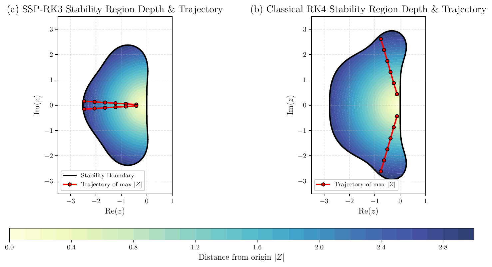

# RK order restoration via optimised near-boundary stencils



Differential Evolution optimisation of near-boundary finite-difference closure
stencils for hyperbolic PDEs with time-dependent Dirichlet data.
The optimised stencils restore the design convergence order of explicit
Runge–Kutta integrators — eliminating the classical order-reduction phenomenon.
Validated on SSP-RK3 (O(dt²) → O(dt³)) and extended to classical RK4
(O(dt²) → O(dt⁴)).

## Repository layout

```
scripts/             # SSP-RK3 stencil optimisation, validation, and figure generation
rk4_extension/       # Classical RK4 extension (optimisation + figures)
data/                # Pre-optimised SSP-RK3 stencil weights (.npz)
rk4_extension/data/  # Pre-optimised RK4 stencil weights (.npz)
images/              # Output directory for generated figures (created on first run)
```

## Requirements

```bash
pip install -r requirements.txt
```

Dependencies: `numpy`, `scipy`, `matplotlib`, `torch`.

## Reproducing the figures

All scripts are designed to be run from the **repository root**.

### SSP-RK3 figures

| Script | Output figure(s) |
|---|---|
| `scripts/generate_figures.py` | `fig_solution`, `fig_convergence`, `fig_generalisability`, `fig_spectral` |
| `scripts/stability_analysis.py` | `fig_stability` |
| `scripts/generate_cfl_sweep.py` | `fig_cfl_sweep` |
| `scripts/wso_comparison.py` | `fig_wso_comparison` |
| `scripts/gershgorin_analysis.py` | `fig_gershgorin` |
| `scripts/plot_stability_distance.py` | `fig_stability_distance` |
| `scripts/validate_euler.py` | `fig_euler_convergence` |
| `scripts/staggered_evaluate_2d.py` | `fig_staggered_convergence` |

### RK4 figures

| Script | Output figure(s) |
|---|---|
| `rk4_extension/rk4_figures.py` | `fig_rk4_convergence`, `fig_rk4_spectral`, `fig_rk4_stability` |
| `rk4_extension/rk4_evaluate.py` | `fig_rk4_convergence` (detailed) |
| `scripts/generate_cfl_sweep.py` | `fig_rk4_cfl_sweep` (combined with RK3) |
| `scripts/rk4_wso_comparison.py` | `fig_rk4_wso_comparison` |

All figures are saved to `images/`.

## Re-running the optimisation

Pre-computed weights are provided in `data/` and `rk4_extension/data/`.
To re-optimise from scratch:

```bash
# SSP-RK3 accuracy-only stencils
python scripts/stencil_optimise.py

# SSP-RK3 stability-augmented stencils (starts from accuracy-only result)
python scripts/stencil_optimise_stable.py

# Classical RK4 accuracy-only
python rk4_extension/rk4_optimise.py

# Classical RK4 stability-augmented
python rk4_extension/rk4_optimise_stable.py
```

Each optimiser uses Differential Evolution (via `scipy.optimize.differential_evolution`)
and writes the result to the appropriate `data/` directory.

## Stencil parametrisation

The boundary closure uses **6 DOFs** (3 free weights per boundary node).
Zeroth- and first-moment consistency constraints are enforced analytically inside
`scripts/stencil_optimise.py` (`make_dudx_func`).
The interior scheme is a fixed 5th-order upwind stencil, unchanged across all variants.

## Authors

Giorgio Maria Cavallazzi, Manuel Pérez Cuadrado, Alfredo Pinelli
*City St. George's, University of London*
